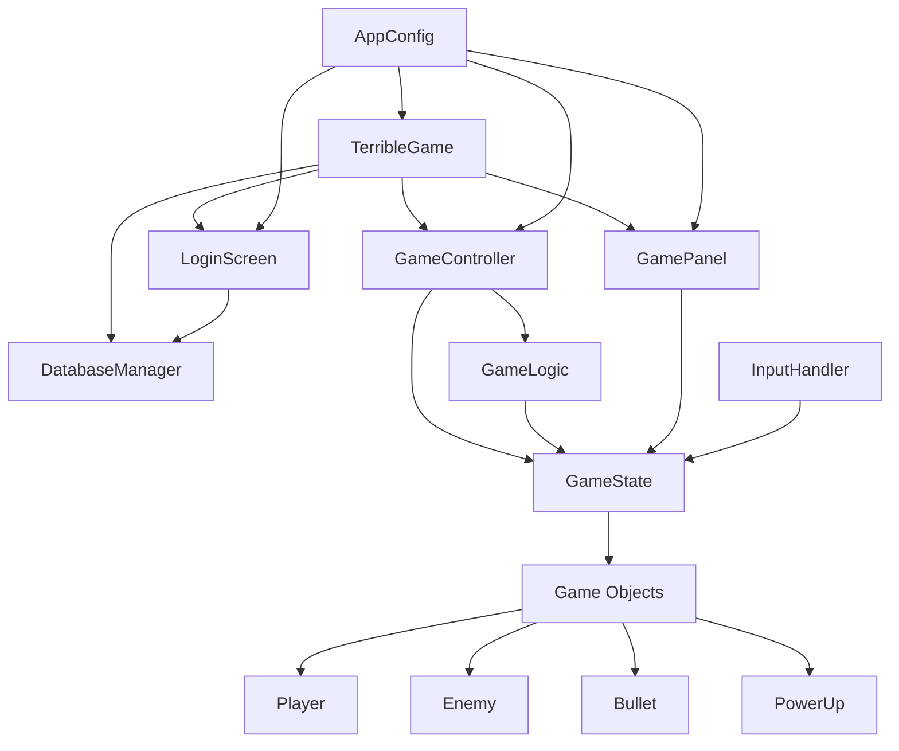

# Secure Space Game

A Java-based space shooter game with secure user authentication and high score tracking.

## Game Overview

Secure Space Game is a classic arcade-style shooter where players control a spaceship, shoot enemies, collect power-ups, and try to achieve high scores. The game features:

- User authentication system with secure password storage
- High score tracking and leaderboard
- Dynamic enemy spawning with size and speed variations
- Power-up system
- Configurable game parameters via environment variables

## Game Mechanics

- **Player Control**: Navigate your ship horizontally at the bottom of the screen
- **Combat**: Shoot bullets to destroy incoming enemy ships
- **Scoring**: 
  - Destroy enemies to earn points (default: 10 points per enemy)
  - Collect power-ups for bonus points (default: 50 points)
- **Lives**: Start with 3 lives, lose one when colliding with enemies
- **Power-ups**: Randomly spawning items that provide score bonuses
- **Game Over**: Occurs when all lives are lost

## Architecture

The game follows a modular architecture with clear separation of concerns:



### Core Components

1. **TerribleGame (Main Application)**
   - Manages the main window and UI components
   - Handles screen transitions (login/game)
   - Coordinates core game components

2. **GameController**
   - Controls game flow
   - Manages the game loop
   - Handles score persistence

3. **GameLogic**
   - Implements game mechanics
   - Handles object spawning
   - Manages collisions
   - Updates game state

4. **GameState**
   - Stores game data (score, lives, objects)
   - Manages game status (running/paused/over)
   - Contains lists of active game objects

5. **Game Objects**
   - Player: Controlled spaceship
   - Enemy: Hostile ships with varying sizes/speeds
   - Bullet: Projectiles fired by the player
   - PowerUp: Collectible bonus items

6. **UI Components**
   - LoginScreen: User authentication and high scores
   - GamePanel: Main game rendering and display

7. **Support Systems**
   - DatabaseManager: Handles data persistence
   - InputHandler: Processes user input
   - AppConfig: Manages game configuration

## Configuration

The game is highly configurable through environment variables (.env file) or system properties. Key configurable aspects include:

- Window dimensions and timing
- Player, enemy, and power-up parameters
- Visual styling (colors, fonts)
- Database settings
- Game mechanics (spawn rates, speeds, scores)

## Building and Running

1. Ensure you have Java and Maven installed
2. Clone the repository
3. Build the project:
```bash
mvn clean package
```
4. Run the game:
```bash
java -jar target/secure-space-game.jar
```

## Dependencies

- Java Swing (UI)
- SQLite (Database)
- BCrypt (Password hashing)
- dotenv-java (Configuration)

## Technical Requirements

- Java 8 or higher
- SQLite database support
- Minimum screen resolution: 800x600